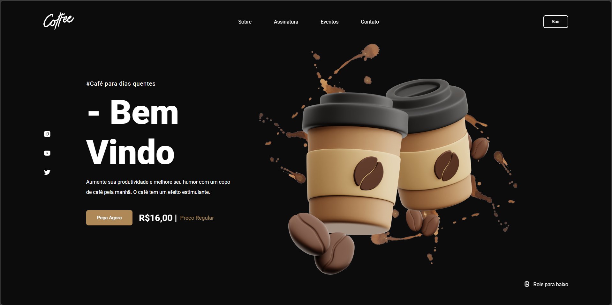
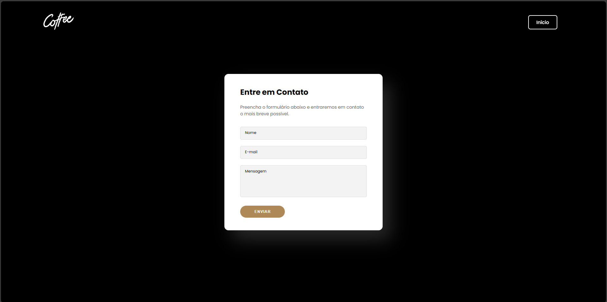

# ☕ Coffee Shop Website

Um site moderno e responsivo para uma cafeteria fictícia, desenvolvido para apresentar o cardápio, contar a história da marca e oferecer uma experiência acolhedora para os clientes.

## 🚀 Tecnologias utilizadas

- **HTML** – Estrutura semântica do site  
- **CSS** – Estilização responsiva e animações  
- **JavaScript** – Interatividade e efeitos dinâmicos  

## 📌 Funcionalidades

- Página inicial com destaque para a marca  
- Cardápio interativo com categorias de cafés, bebidas e sobremesas  
- Sessão *Sobre nós* com a história da cafeteria  
- Formulário de contato para pedidos e dúvidas  
- Layout responsivo para diferentes dispositivos  

## 📷 Preview

Adicione aqui uma imagem ou GIF do site em funcionamento.  
Exemplo:  


### Outras páginas


## 🛠️ Como executar o projeto

Clone este repositório e abra o projeto localmente:

```bash

# Acesse a pasta do projeto
cd coffee-shop

# Abra o arquivo index.html no navegador
